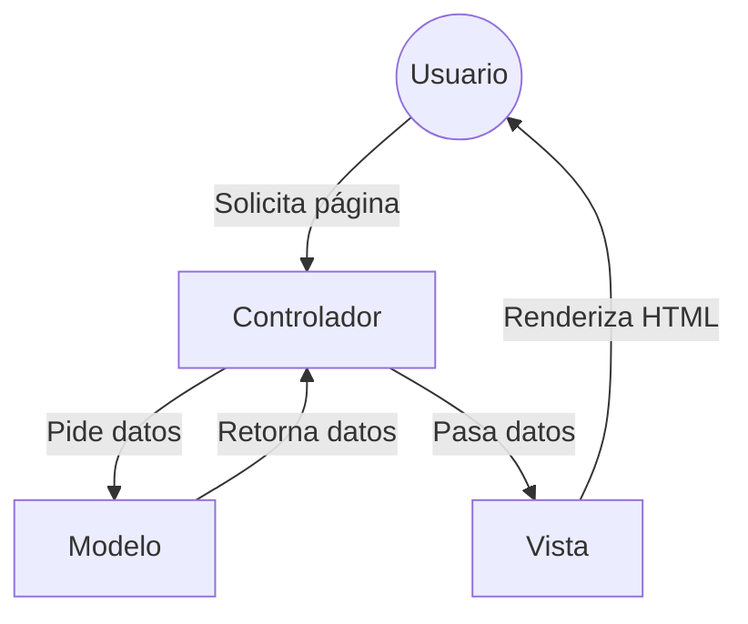

# Diagrama del funcionamiento

# Qué es MVC?

* MVC es un patrón de arquitectura de software que se utiliza para crear aplicaciones web.
* **Model**: Lógica de negocio y datos (Base de datos).
* **View**: Presentación (HTML/CSS que ve el usuario).
* **Controller**: Intermediario que recibe peticiones y decide qué hacer.

# Config

* Aca vamos a definir nuestras constantes para conectar a la base de datos, por ejemplo:
* Si tuvieramos un usuario y contraseña con menos privilegios, lo definiramos aca. En este caso, usaremos el root con todos los privilegios.
* Server seria la ip de la maquina donde esta la base de datos. En este caso, es localhost.
* DB seria el nombre de la base de datos. En este caso, es examen pero por suponer algo, podria ser cualquier nombre.

// Configuración de la base de datos
const USER = "root"; -> El nombre de usuario de la base de datos
const PASS = ""; -> La contraseña de la base de datos
const SERVER = "localhost"; -> El servidor de la base de datos
const DB = "examen"; -> El nombre de la base de datos
define("DSN", "mysql:host=" . SERVER . ";dbname=" . DB); -> La cadena de conexión a la base de datos

# Model

* Esto es como nuestra plantilla para crear modelos, es decir, para crear tablas en la base de datos.
* Que hace nuestro modelo? En este MVC nos conectaria directamente a la base de datos. Por lo que ya tendriamos una conexion donde ya nuestro codigo va a saber que tablas tiene dicha base de datos. Por eso en el controller podemos hacer querys.

# Controller

* El controller en realidad seria un controlador de una tabla en especifico. Imaginate que tenemos una base de datos con 3 tablas: 
    * tabla1
    * tabla2
    * tabla3
* Pues tendriamos 3 controladores: 
    * controller1 -> actua sobre la tabla1
    * controller2 -> actua sobre la tabla2
    * controller3 -> actua sobre la tabla3

* Ejemplo practico: 
    * Tenemos una tabla llamada vehiculos.
    * Tendriamos un controller llamado controllerVehiculos.
    * En este controller tendriamos los metodos para obtener datos de la tabla vehiculos.
    * Por ejemplo: 
        * obtenerDatos() -> obtiene todos los datos de la tabla vehiculos
        * obtenerDato(id) -> obtiene un dato de la tabla vehiculos por id
        * insertarDato(datos) -> inserta un dato en la tabla vehiculos
        * actualizarDato(id, datos) -> actualiza un dato en la tabla vehiculos por id
        * eliminarDato(id) -> elimina un dato de la tabla vehiculos por id

* Pero si tuvieramos otra tabla motos, tendriamos otro controller llamado controllerMotos con los mismos metodos U OTROS diferentes que solo necesiten la moto!!!

# Index

* El index es el punto de entrada de nuestra aplicacion. Es el archivo que se ejecuta cuando entramos a nuestra aplicacion.
* En este caso, el index es el que se encarga de crear un objeto de tipo Controller y obtener los datos de la tabla vehiculos.
* Y mostrarlos al cliente, podes tener un formulario, una tabla, etc.

